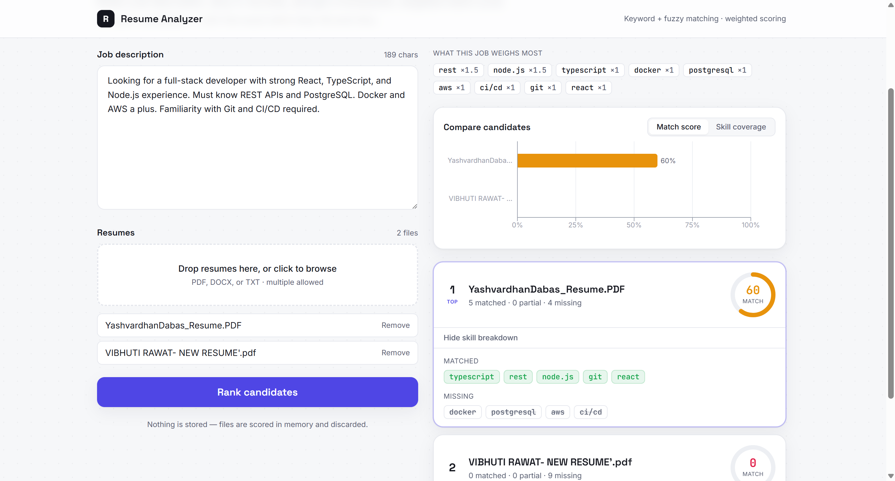

# Resume Analyzer

> Screen resumes against a job description using keyword + fuzzy matching and a weighted scoring algorithm, then rank candidates by match percentage.

A full-stack tool that takes a job description and a batch of resumes (PDF / DOCX / TXT) and produces a transparent, ranked shortlist — showing the exact skills each candidate hits, partially hits, and misses.

<!-- After deploying, add your live link here: -->
<!-- **🔗 Live demo:** https://your-app-url.com -->


<!-- Add a screenshot at docs/screenshot.png once the app is running -->

---

## Why it exists

Recruiters skim hundreds of resumes per role. A naive keyword search is easy to game and misses obvious equivalents — "JS" vs "JavaScript", "Postgres" vs "PostgreSQL", "led a team" vs "leadership". This tool addresses that with a skill taxonomy (alias-aware matching), fuzzy matching for variants and typos, and **weighted** scoring so the skills a job actually emphasizes count for more.

## How it works

1. **Parse** — extract clean text from each resume (PDF via `pdfplumber`, DOCX via `python-docx`).
2. **Analyze the job description** — detect the skills it mentions and weight each one by how often it appears, plus pick up other significant repeated terms.
3. **Match** — for every weighted keyword, look for an exact match (alias-aware) or a close fuzzy match (`rapidfuzz`).
4. **Score & rank** — each candidate earns a fraction of each keyword's weight based on match quality:

   ```
   score = Σ(weight × match_quality) / Σ(weight) × 100
   ```

   Missing a heavily-weighted skill hurts more than missing a minor one.

## Tech stack

| Layer     | Tech                                                        |
|-----------|-------------------------------------------------------------|
| Frontend  | React, TypeScript, Vite, Tailwind CSS                       |
| Backend   | Python, FastAPI, Uvicorn                                    |
| Matching  | RapidFuzz (fuzzy), custom weighted scoring, skill taxonomy  |
| Parsing   | pdfplumber, python-docx                                     |

## Project structure

```
resume-analyzer/
├── backend/                # FastAPI API + matching engine
│   ├── app/
│   │   ├── data/skills.json # skill taxonomy (canonical -> aliases)
│   │   ├── taxonomy.py      # skill detection / normalization
│   │   ├── parsing.py       # PDF / DOCX / TXT text extraction
│   │   ├── matching.py      # core: JD analysis, scoring, ranking
│   │   ├── schemas.py       # API response models
│   │   └── main.py          # FastAPI app + /api/analyze
│   └── requirements.txt
└── frontend/               # React + TypeScript UI
    └── src/
        ├── api.ts           # backend client + types
        ├── App.tsx
        └── components/      # dropzone, score ring, candidate cards…
```

## Running locally

You'll run the backend and frontend in two terminals.

### 1. Backend (port 5000)

```bash
cd backend
python -m venv venv
source venv/bin/activate        # Windows: venv\Scripts\activate
pip install -r requirements.txt
uvicorn app.main:app --reload --port 5000
```

API docs (interactive): http://localhost:5000/docs

### 2. Frontend (port 3000)

```bash
cd frontend
npm install
npm run dev
```

Open http://localhost:3000. By default the frontend talks to `http://localhost:5000`; override with a `frontend/.env` file (see `.env.example`).

## Possible extensions

- Semantic matching with embeddings or TF-IDF (catch meaning, not just words)
- Section-aware parsing (weight skills in "Experience" over "Interests")
- Adjustable per-skill weights in the UI
- Export shortlist to CSV

## License

MIT — see [LICENSE](LICENSE).
